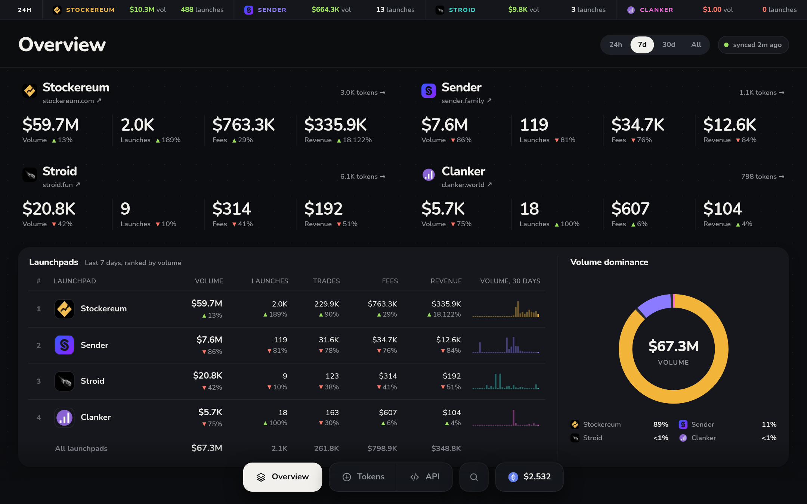
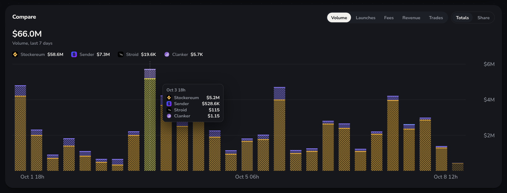
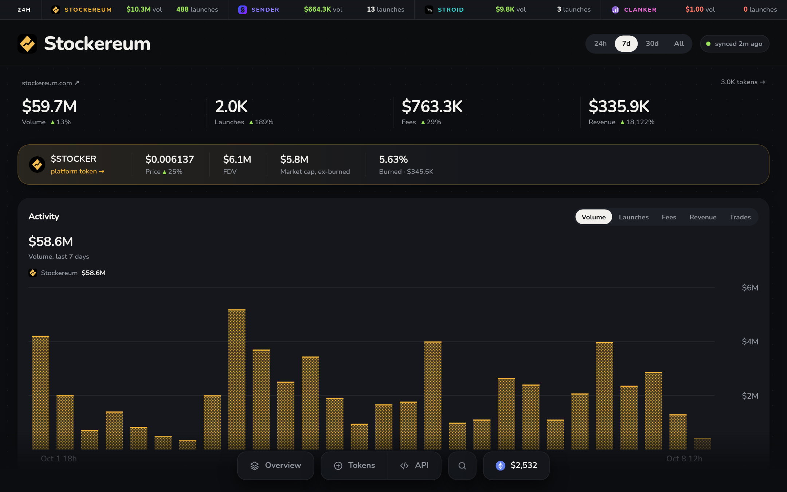
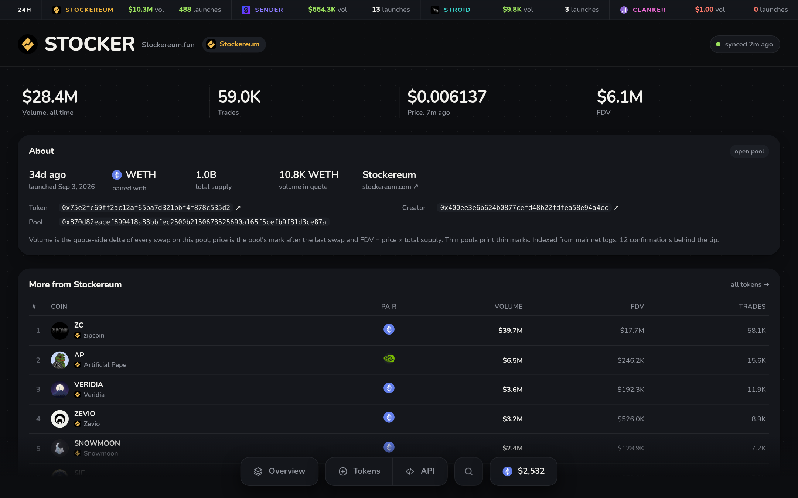
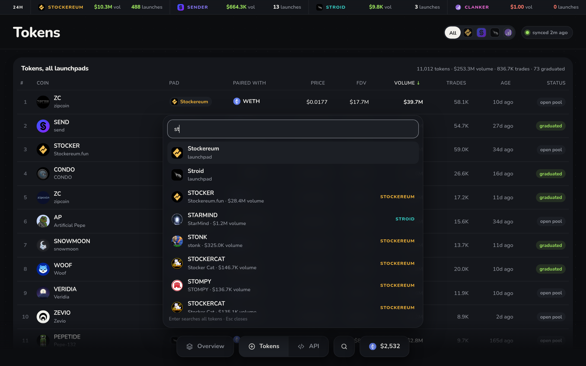
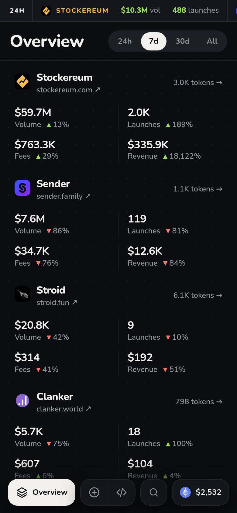
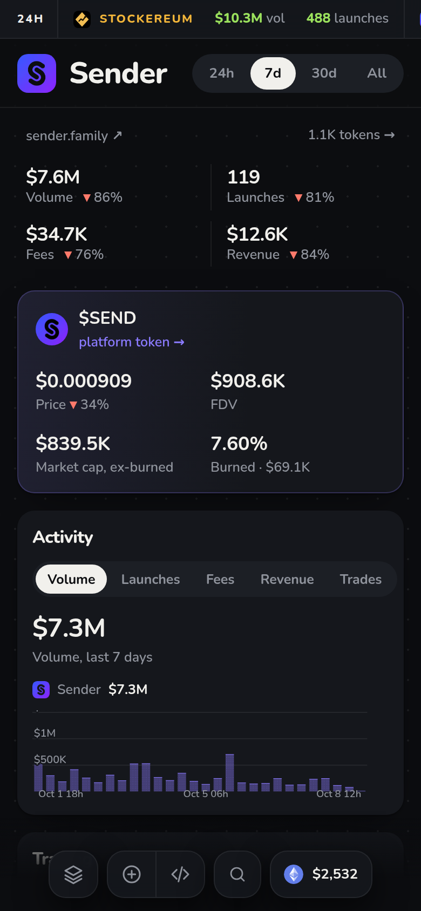

# Padboard

**Launchpads, side by side.** Live analytics for Ethereum token launchpads,
read straight from mainnet logs.

[padboard.app](https://padboard.app) · [API](https://padboard.app/api) · [snapshot.json](https://padboard.app/api/snapshot.json)



Padboard compares [Stockereum](https://stockereum.com),
[Sender](https://sender.family), [Stroid](https://stroid.fun) and
[Clanker](https://clanker.world) on volume, launches, trades, fees and
revenue, for the last 24 hours, 7 days, 30 days or all time. Every number comes
from chain logs: factory launches, Uniswap v4 PoolManager swaps, and each
platform's fee, hook and locker contracts. Nothing is scraped from the
platforms' websites.

## What's in it

- **Overview.** A ticker for the last 24 hours, one card per launchpad, a
  leaderboard with sparklines and a volume dominance donut. The page refreshes
  itself every minute while it's open.
- **Compare.** One stacked chart across every launchpad. Pick a metric and
  switch between totals and market share. The bucket still in progress is
  drawn faded.
- **Launchpad pages** (`/p/stockereum`). Windows, an activity chart, trading,
  fees, the platform's own token (price, FDV, burned supply) and its top coins.
- **Token pages** (`/t/0x…`). Volume, trades, price, FDV, pair, pool and
  creator for every launched token.
- **Search.** Press `/` anywhere for typeahead over tokens and launchpads.
- **JSON API.** Free, 60 requests per minute per IP.



| Launchpad page | Token page |
| --- | --- |
|  |  |



| Phone: overview | Phone: launchpad |
| --- | --- |
|  |  |

## How it works

One Go binary, standard library only. It pulls new blocks every few minutes
(12 confirmations behind the tip), decodes the logs, and folds them into an
hourly snapshot per launchpad, saved as `state.json`. Each launchpad has its
own sync cursor, so adding one backfills it from its first launch while the
others keep syncing.

- **Volume** is the quote-side delta of every swap on a launched token's pool,
  converted to USD.
- **Fees** are the trading fees paid on those pools, whoever receives them
  (creator, holders, platform, partners). **Revenue** is the platform's share
  of them plus launch fees.
- **Price** is the pool's mark after the last swap, and FDV is price × total
  supply.

Pages are server-rendered HTML with SVG charts and no client framework. Each
page is rendered once per sync and minute, then served gzipped with
content-hash ETags (304 when unchanged).

## Run

Requires Go 1.27 and an [Alchemy](https://www.alchemy.com) API key for
Ethereum mainnet (JSON-RPC and the Prices API).

```sh
echo "ALCHEMY_API_KEY=..." > .env
go run .   # first run backfills every launchpad (a few minutes), then serves on :8080
```

| Variable          | Default | Purpose                                                       |
| ----------------- | ------- | ------------------------------------------------------------- |
| `ALCHEMY_API_KEY` | —       | required                                                      |
| `PORT`            | `8080`  | HTTP listen port                                              |
| `DATA_DIR`        | `data`  | where `state.json` (the snapshot) is written                  |
| `SYNC_INTERVAL`   | `5m`    | how often new blocks are pulled                               |
| `SYNC_ONCE`       | unset   | if set, exit after one sync once backfill is done (cron use)  |

A `Dockerfile` is included. Production runs on Railway with a volume mounted
at `/data`.

## Routes

| Path | What |
| --- | --- |
| `/` | overview |
| `/tokens` | every launch, filter by launchpad, search, sort, 100 per page |
| `/p/{launchpad}` | one launchpad |
| `/t/{address}` | one token |
| `/api` | API docs |
| `/api/v1/summary` | per-launchpad windows and totals |
| `/api/v1/daily?interval=day\|hour` | time series |
| `/api/v1/tokens?pad&sort&q&page` | token list |
| `/api/v1/tokens/{address}` | one token |
| `/api/snapshot.json` | the full snapshot |
| `/healthz` | health probe |

## Development

```sh
gofmt -l . && go vet ./... && go test ./...
```

Early development: launchpads, metrics and the API may still change.
